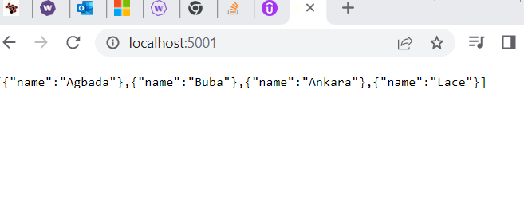
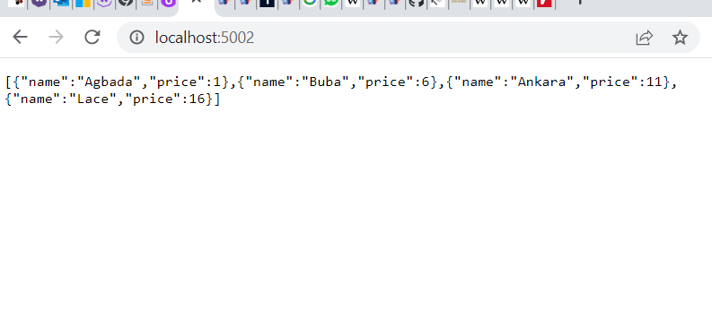
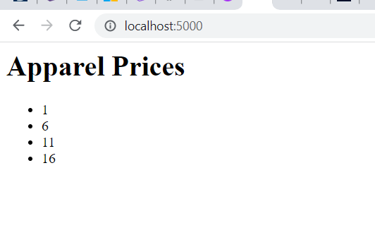

#### The Application will consist of a php front end with a node and postgresql backend

#### POSTGRES CONTAINER -sql Database
- We create the script to run during container creation - docker-compose

```
mkdir db
touch db/Dockerfile
touch db/init.sql
```
#### Inside init.sql
```
CREATE TABLE apparel(
    name character varying(50)
);

INSERT INTO apparel (name) VALUES ('Agbada'),
('Buba'),
('Ankara'),
('Lace');

```

#### Next we add the db instruction to the dockerfile
- postgres base image
- copy the initialisation script to the default entry point postgres folder

```
FROM postgres

COPY ./init.sql /docker-entrypoint-initdb.d/
```
#### run docker-compose up

```
docker-compose up
```
#### This failed as superuser password wasn't specified.  We must specify -e POSTGRES_PASSWORD=PASSWORD on docker run or use the dangerous POSTGRES_HOST_AUTH_METHOD=trust to allow all connections

#### Updated Dockerfile. It is set as an enviroment variable

```
FROM postgres

ENV POSTGRES_HOST_AUTH_METHOD=trust

COPY ./init.sql /docker-entrypoint-initdb.d/
```

```
docker-compose up
```

```
db_1  | PostgreSQL init process complete; ready for start up.        
db_1  |
db_1  | 2022-10-30 08:51:52.657 UTC [1] LOG:  starting PostgreSQL 15.0 (Debian 15.0-1.pgdg110+1) on x86_64-pc-linux-gnu, compiled by gcc (Debian 10.2.1-6) 10.2.1 20210110, 64-bit
db_1  | 2022-10-30 08:51:52.658 UTC [1] LOG:  listening on IPv4 address "0.0.0.0", port 5432
db_1  | 2022-10-30 08:51:52.658 UTC [1] LOG:  listening on IPv6 address "::", port 5432
db_1  | 2022-10-30 08:51:52.708 UTC [1] LOG:  listening on Unix socket "/var/run/postgresql/.s.PGSQL.5432"
db_1  | 2022-10-30 08:51:52.795 UTC [63] LOG:  database system was shut down at 2022-10-30 08:51:52 UTC
db_1  | 2022-10-30 08:51:52.818 UTC [1] LOG:  database system is ready to accept connections
```


To see our inserted data inserted by our init script, we could connect to the container with the shell using the container id

```
docker container ls
```
```
PS C:\Users\deles\Documents\docker-custom-network-multi-container> docker container ls
CONTAINER ID   IMAGE                                      COMMAND                  CREATED         STATUS          PORTS      NAMES      
886ddbf3581e   docker-custom-network-multi-container_db   "docker-entrypoint.s…"   2 minutes ago   Up 22 seconds   5432/tcp   docker-custom-network-multi-container_db_1
```
#### Then i'll connect to the container using the exec command

```
docker exec -it <container id> bash
```

#### Now that we are in the container, we can execute our sql script using the psql command with ourdefault postgres user - postgres on our database also called postgres

```
psql -U postgres postgres
```

#### This will now give us the postgres prompt and we can now interact with our database using sql

```
SELECT * from apparel;
```

```
PS C:\Users\deles\Documents\docker-custom-network-multi-container> docker exec -it 886ddbf3581e bash
root@886ddbf3581e:/# psql -U postgres postgres
psql (15.0 (Debian 15.0-1.pgdg110+1))
Type "help" for help.

postgres=# SELECT * FROM apparel;
  name     
--------   
 Agbada    
 Buba      
 Ankara    
 Lace      
(4 rows)   

postgres=# 
```

#### Stoprunning container with Control + C
### Now we have our postgress container at the backend. We shall now set up other containers that can manipulate that data


#### Let's create 2 more containers
Container 1: Node Express    Serve up Core container Data
Container 2: Flask Container  Additional items to core data - Enhances core data

#### Create container to serve up core data
#### Let's edit the docker-compose.yml file

#### Create new service (node express) called apparel to get data from database from a /get endpoint

#### Updated docker-compose.yml
```
version: "3"

services:
  db:
    build: ./db
 
  apparel:
    build: ./apparel

```
#### We create a volume for instant updates and depends on the db service

```
version: "3"

services:
  db:
    build: ./db
 
  apparel:
    build: ./apparel

  volumes:
    - ./apparel:/app   
  depends_on  
    - db

```

#### We shall create the apparel directory containing
```
    Dockerfile
    server.js
    package.json
```

#### In server.js

```
const express= require('express');
const { Pool }  = require('pg');

const HOST = '0.0.0.0';
const PORT = 80;

const app = express();

const pool = new Pool({ user:'postgres', host:'db' });


app.get('/',(req,res)=>{

pool.query('SELECT * FROM apparel',(error,response)=>{

res.json(response.rows)
});

});

app.listen(PORT,HOST);
console.log(`Running on PORT http://${HOST}:${PORT}`);

```

#### Inside package.json for apparel

```
{

"dependencies":{
    "express":"^4.16.1",
    "pg":"^8.8.0"
}

}
```

#### Inside Dockerfile for apparel
```
FROM node
WORKDIR /app
RUN npm -g nodemon
COPY package.json package.json
RUN npm install
COPY . .
EXPOSE 80
CMD ["nodemon","server.js"]

```
```
docker-compose up
```
-
- error as npm not installed. error in code
- also node_modules not copied globally

#### Dockerfile after edit

```

FROM node
WORKDIR /app
RUN npm install -g nodemon
COPY package.json package.json
RUN npm install
RUN mv /app/node_modules /node_modules
COPY . .
EXPOSE 80
CMD ["nodemon","server.js"]
```

#### Run again with the build option

```
docker-compose up --build

```





#### Now we shall add another container that will be devoted to prices.

- We shall make our prices container containing
 - dockerfile
   requirements.txt as flask app (py) instead of package.json
   app.py
```
mkdir prices
touch prices/app.py
touch prices/Dockerfile
touch requirements.txt
```

#### In app.py

```
import json, requests
from flask import Flask,jsonify

app = Flask(__name__)

@app.route('/')
def prices():
    data = requests.get('http://apparel').json()

    for i in range(len(data)):
        data[i]['price'] = i*5 +1

    return jsonify(data)

if __name__ == '__main__':
    app.run(host='0.0.0.0', port=80)


```

#### Next we set dependencies in requirements.txt as below
```
Flask==2.2.2
Requests==2.28.1
```


#### Dockerfile for prices container
```
FROM python
WORKDIR /app
COPY requirements.txt requirements.txt
RUN pip install -r requirements.txt
COPY . .
EXPOSE 80
CMD ["python", "app.py"]

```

#### I will now update docker-compose.yml with the price build

```
version: "3"

services:
  db:
    build: ./db
 
  apparel:
    build: ./apparel

    volumes:
    - ./apparel:/app
    ports:
    - 5001:80   
    depends_on:  
    - db

  prices:
    build: ./prices
    volumes:
     - ./prices:/app
    ports:
     -5002:80
    depends_on:
      - apparel
```

#### run docker-compose up again

```
Attaching to docker-custom-network-multi-container-apparel-1, docker-custom-network-multi-container-db-1, docker-custom-netw
docker-custom-network-multi-container-db-1       | 
docker-custom-network-multi-container-db-1       | PostgreSQL Database directory appears to contain a database; Skipping ini
docker-custom-network-multi-container-db-1       | 
docker-custom-network-multi-container-db-1       | 2022-11-13 11:01:13.932 UTC [1] LOG:  starting PostgreSQL 15.1 (Debian 15linux-gnu, compiled by gcc (Debian 10.2.1-6) 10.2.1 20210110, 64-bit
docker-custom-network-multi-container-db-1       | 2022-11-13 11:01:13.933 UTC [1] LOG:  listening on IPv4 address "0.0.0.0"
docker-custom-network-multi-container-db-1       | 2022-11-13 11:01:13.933 UTC [1] LOG:  listening on IPv6 address "::", por
docker-custom-network-multi-container-db-1       | 2022-11-13 11:01:13.955 UTC [1] LOG:  listening on Unix socket "/var/run/
docker-custom-network-multi-container-db-1       | 2022-11-13 11:01:13.990 UTC [28] LOG:  database system was shut down at 2
docker-custom-network-multi-container-db-1       | 2022-11-13 11:01:14.029 UTC [1] LOG:  database system is ready to accept 
docker-custom-network-multi-container-apparel-1  | [nodemon] 2.0.20
docker-custom-network-multi-container-apparel-1  | [nodemon] to restart at any time, enter `rs`
docker-custom-network-multi-container-apparel-1  | [nodemon] watching path(s): *.*
docker-custom-network-multi-container-apparel-1  | [nodemon] watching extensions: js,mjs,json
docker-custom-network-multi-container-apparel-1  | [nodemon] starting `node server.js`
docker-custom-network-multi-container-apparel-1  | Running on PORT http://0.0.0.0:80
docker-custom-network-multi-container-prices-1   |  * Serving Flask app 'app'
docker-custom-network-multi-container-prices-1   |  * Debug mode: off
docker-custom-network-multi-container-prices-1   | WARNING: This is a development server. Do not use it in a production deployment. Use a production WSGI server instead.
docker-custom-network-multi-container-prices-1   |  * Running on all addresses (0.0.0.0)
docker-custom-network-multi-container-prices-1   |  * Running on http://127.0.0.1:80
docker-custom-network-multi-container-prices-1   |  * Running on http://172.18.0.4:80
```

### In the browser
localhost:5002




### The final container will be a php container.
- folder called site will contain index.php and Dockerfile

```
mkdir site
touch site/index.php
touch site/Dockerfile

```

#### Dockerfile for prices
```
FROM php
WORKDIR /src
COPY index.php ./
EXPOSE 80
CMD ["php","-S","0.0.0.0:80"]

```

#### index.php for prices

```
<html>
    <head>
        <title> My Page

        </title>
    </head>
    <body>
        <h1>Apparel Prices</h1>

    <ul>
        
    <?php
        $json = file_get_contents('http://prices');
        $price_items = json_decode($json);
        foreach($price_items as $price_item){
            echo "<li> $price_item->price </li>";
        }
    ?>
    </ul>
    </body>
</html>
```

#### Updated docker-compose.yml for all 4 services

```
version: "3"

services:
  db:
    build: ./db
 
  apparel:
    build: ./apparel

    volumes:
    - ./apparel:/app
    ports:
    - 5001:80   
    depends_on:  
    - db

  prices:
    build: ./prices

    volumes:
     - ./prices:/app
    ports:
     - 5002:80
    depends_on:
     - apparel

  site:
    build: ./site

    ports:
     - 5000:80

    volumes:
     - ./site:/src

    depends_on:
     - prices
      
```

#### Next run docker-compose up to launch our 4 containers

```
docker-compose up
```

```
Attaching to docker-custom-network-multi-container-apparel-1, docker-custom-network-multi-container-db-1, docker-custom-network-multi-container-prices-1, docker-custom-network-multi-container-site-1
docker-custom-network-multi-container-db-1       | 
docker-custom-network-multi-container-db-1       | PostgreSQL Database directory appears to contain a database; Skipping initialization
docker-custom-network-multi-container-db-1       | 
docker-custom-network-multi-container-db-1       | 2022-11-13 16:53:55.486 UTC [1] LOG:  starting PostgreSQL 15.1 (Debian 15.1-1.pgdg110+1) on x86_64-pc-linux-gnu, compiled by gcc (Debian 10.2.1-6) 10.2.1 20210110, 64-bit
docker-custom-network-multi-container-db-1       | 2022-11-13 16:53:55.492 UTC [1] LOG:  listening on IPv4 address "0.0.0.0", port 5432
docker-custom-network-multi-container-db-1       | 2022-11-13 16:53:55.493 UTC [1] LOG:  listening on IPv6 address "::", port 5432docker-custom-network-multi-container-db-1       | 2022-11-13 16:53:55.509 UTC [1] LOG:  listening on Unix socket "/var/run/postgresql/.s.PGSQL.5432"
docker-custom-network-multi-container-db-1       | 2022-11-13 16:53:55.534 UTC [28] LOG:  database system was shut down at 2022-11-13 16:48:37 UTC
docker-custom-network-multi-container-db-1       | 2022-11-13 16:53:55.570 UTC [1] LOG:  database system is ready to accept connections
docker-custom-network-multi-container-apparel-1  | [nodemon] 2.0.20
docker-custom-network-multi-container-apparel-1  | [nodemon] to restart at any time, enter `rs`
docker-custom-network-multi-container-apparel-1  | [nodemon] watching path(s): *.*
docker-custom-network-multi-container-apparel-1  | [nodemon] watching extensions: js,mjs,json
docker-custom-network-multi-container-apparel-1  | [nodemon] starting `node server.js`
docker-custom-network-multi-container-apparel-1  | Running on PORT http://0.0.0.0:80
docker-custom-network-multi-container-prices-1   |  * Serving Flask app 'app'
docker-custom-network-multi-container-prices-1   |  * Debug mode: off
docker-custom-network-multi-container-prices-1   | WARNING: This is a development server. Do not use it in a production deployment. Use a production WSGI server instead.
docker-custom-network-multi-container-prices-1   |  * Running on all addresses (0.0.0.0)
docker-custom-network-multi-container-prices-1   |  * Running on http://127.0.0.1:80
docker-custom-network-multi-container-prices-1   |  * Running on http://172.18.0.4:80
docker-custom-network-multi-container-prices-1   | Press CTRL+C to quit
docker-custom-network-multi-container-site-1     | [Sun Nov 13 16:54:00 2022] PHP 8.1.12 Development Server (http://0.0.0.0:80) started
```

#### browser localhost:5000



#### 4 containers are now running
- db
- apparel
- price
- site


####  For security reasons, We do not want the front end to be able to grab information directly from the core apparel container which get its information directly from the database.
#### We want it to only be able to access the prices service and its Data.

##### We shall achieve this by setting up 2 custom networks for our application

##### Since all services by default are in the same network and able to communicate with each other, we need to overide this default behaviour.

- I will make a new entry in the docker-compose.yml called networks. Under this will be 2 networks called core and site.
```
networks: 
  core:
  site:
```
##### Next we specify for each network a driver which defines how it is set up.


```
networks: 
  core:
    driver: 
  site:
    driver:
```
##### We will use the bridge network type for both network drivers which is dockers default network.

```
networks: 
  core:
    driver: bridge
  site:
    driver: bridge
```

##### Next, we need to grant access only to networks that need them.

We shall grant access to core to (db,apparel,price)
We shall grant access to site to (site,price)


